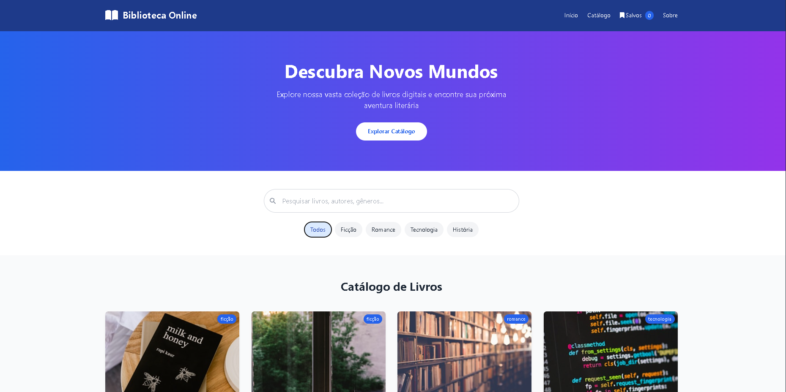
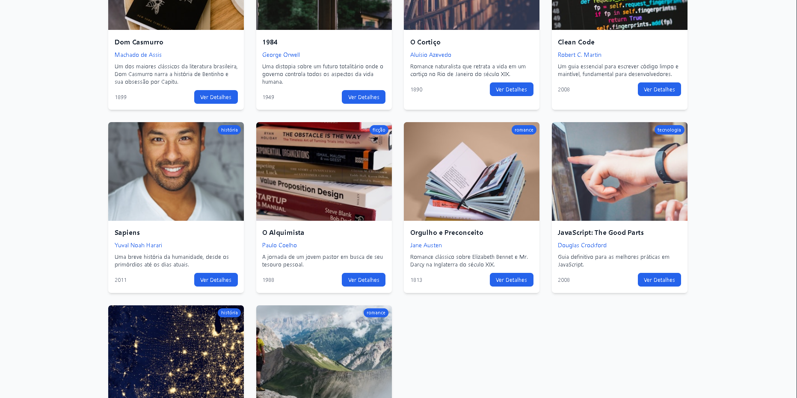
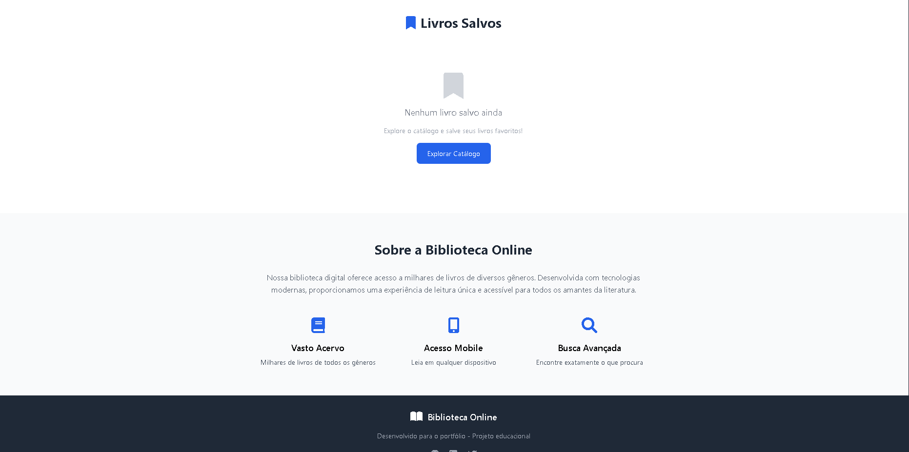

# 📚 Biblioteca Online

Uma aplicação web moderna e responsiva para explorar e gerenciar uma coleção de livros digitais. Desenvolvida com HTML5, CSS3 e JavaScript, oferece uma experiência de usuário intuitiva e recursos avançados de busca e organização.

### 📖 Catálogo de Livros
- **Visualização em Grid**: Layout responsivo com cards elegantes
- **Informações Detalhadas**: Título, autor, categoria, ano e descrição
- **Capas Dinâmicas**: Imagens de alta qualidade via Unsplash
- **Modal de Detalhes**: Visualização expandida com opções de ação

### 🔍 Sistema de Busca e Filtros
- **Busca Inteligente**: Pesquisa por título, autor ou categoria
- **Filtros por Categoria**: Ficção, Romance, Tecnologia, História
- **Busca em Tempo Real**: Resultados instantâneos conforme digitação
- **Indicador de Resultados**: Feedback visual quando não há resultados

### 💾 Gerenciamento de Favoritos
- **Salvar Livros**: Sistema de favoritos com persistência local
- **Seção Dedicada**: Página exclusiva para livros salvos
- **Contador Dinâmico**: Indicador no header com quantidade de salvos
- **Remoção Fácil**: Botões para remover da lista de favoritos

### 🔔 Sistema de Notificações
- **Feedback Visual**: Notificações para ações do usuário
- **Tipos Diferentes**: Success, Info e Error com cores distintas
- **Animações Suaves**: Transições elegantes de entrada e saída

### 📱 Experiência de Leitura
- **Modal de Leitura**: Interface dedicada para leitura simulada
- **Botão "Ler Agora"**: Acesso rápido ao conteúdo
- **Layout Otimizado**: Tipografia e espaçamento para melhor legibilidade
- **Navegação Intuitiva**: Controles fáceis de usar

### 🎨 Design e UX
- **Design Responsivo**: Funciona perfeitamente em todos os dispositivos
- **Menu Mobile**: Navegação otimizada para smartphones
- **Animações CSS**: Transições suaves e efeitos visuais
- **Tema Moderno**: Paleta de cores profissional e atrativa

## 🛠️ Tecnologias Utilizadas

- **HTML5**: Estrutura semântica e acessível
- **CSS3**: Estilização avançada com Flexbox e Grid
- **JavaScript ES6+**: Funcionalidades interativas e manipulação do DOM
- **Tailwind CSS**: Framework CSS para estilização rápida

### 🔍 Sistema de Busca
- Busca em tempo real por título, autor ou categoria
- Filtros por categoria com botões interativos
- Combinação de busca textual com filtros de categoria
- Feedback visual para buscas sem resultados

### 💾 Gerenciamento de Estado
- Persistência de livros salvos usando LocalStorage
- Sincronização entre diferentes seções da aplicação
- Contadores dinâmicos atualizados em tempo real
- Estado consistente entre sessões do navegador

### 🎯 Interações do Usuário
- Clique nos cards para abrir modal de detalhes
- Botões de ação com feedback visual
- Navegação suave entre seções
- Menu mobile com toggle animado

## 🎨 Capturas de Tela

<a href="https://www.linkedin.com/in/arthur-lima-027581326/" <i class="fab fa-linkedin text-xl"></i></a>
